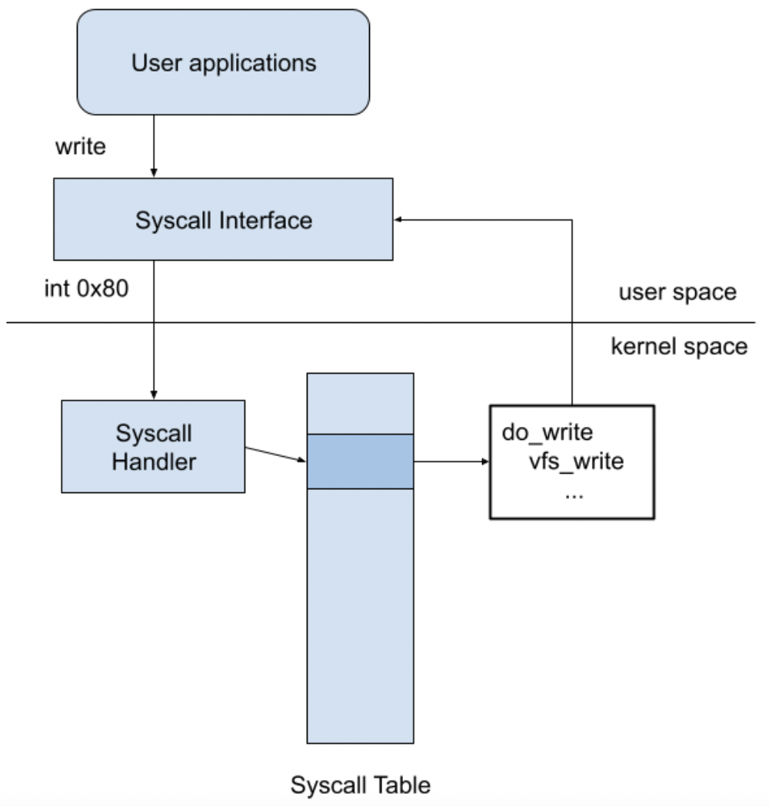

# Effective System Call Aggregation(ESCA) Document
## ESCA Design
The code section enclosed by `batch_start()` and `batch_flush()` is called batching segment. It can appear more than one time in a single application. Compared with typical syscalls, ESCA eliminates mode switches in batching segments by decoupling syscalls. Instead of switching to the kernel or executing the corresponding service routine, syscalls in batching segment only record their syscall ID and arguments in the shared table.After batch_flush is called, ESCA finally switches to kernel mode, executes all syscalls in the shared table, and then switches back to user mode.
## Typical system call flow
### Overview


1. User application call system call
2. From user mode switches to kernel mode by an interrupt 
3. Search interrupt vector table and call interrupt service routine(ISR)
4. The corresponding interrupt service routine would search system call table
5. Call system call service routine
6. After finishing system call service routine, switch back to user mode

### System call wrapper function
Because system call is called by assembly code, wrapping the assembly code with the wrapper function would increase readability of the program.

Ex:
```c
#define SYSCALL(name, a1, a2, a3, a4, a5, a6)                             \
    ({                                                                    \
        long result;                                                      \
        long __a1 = (long) (a1), __a2 = (long) (a2), __a3 = (long) (a3);  \
        long __a4 = (long) (a4), __a5 = (long) (a5), __a6 = (long) (a6);  \
        register long _a1 asm("rdi") = __a1;                              \
        register long _a2 asm("rsi") = __a2;                              \
        register long _a3 asm("rdx") = __a3;                              \
        register long _a4 asm("r10") = __a4;                              \
        register long _a5 asm("r8") = __a5;                               \
        register long _a6 asm("r9") = __a6;                               \
        asm volatile("syscall\n\t"                                        \
                     : "=a"(result)                                       \
                     : "0"(name), "r"(_a1), "r"(_a2), "r"(_a3), "r"(_a4), \
                       "r"(_a5), "r"(_a6)                                 \
                     : "memory", "cc", "r11", "cx");                      \
        (long) result;                                                    \
    })

#define SYSCALL1(name, a1) SYSCALL(name, a1, 0, 0, 0, 0, 0)
#define SYSCALL2(name, a1, a2) SYSCALL(name, a1, a2, 0, 0, 0, 0)
#define SYSCALL3(name, a1, a2, a3) SYSCALL(name, a1, a2, a3, 0, 0, 0)
#define SYSCALL4(name, a1, a2, a3, a4) SYSCALL(name, a1, a2, a3, a4, 0, 0)
#define SYSCALL5(name, a1, a2, a3, a4, a5) SYSCALL(name, a1, a2, a3, a4, a5, 0)
#define SYSCALL6(name, a1, a2, a3, a4, a5, a6) \
    SYSCALL(name, a1, a2, a3, a4, a5, a6)

/* wrapper function */
static inline void *brk(void *addr)
{
    return (void *) SYSCALL1(__NR_brk, addr);
}
```
## How ESCA replace system call  (hook system call)
We cannot add syscalls without modifying the Linux kernel. What we can do is to replace an entry of the syscall table with our customized handler. It is crucial to make sure that the replaced entry is unused; otherwise, the system may crash after hooking the syscalls.

ESCA locate the address of the syscall table through the kernel symbol table and replace the syscall table entry with our customized handler. Also, it is necessary to clear the write protection bit of the control register if modifying the syscall table is required.

### Two system call ESCA replaced
1. sys_batch: iterate shared table and execute all syscalls recorded in the shared table, then switch back to user mode.
2. sys_register: mapping userspace shared table to kernel space memory and initialization.
### Replace systemcall handler
```c
// find out syscall table address
scTab = (void **) (smSCTab + ((char *) &system_wq - smSysWQ));
// clear write protection bit
allow_writes();

/* backup original system call service routine */
sys_oldcall0 = scTab[__NR_batch_flush];
sys_oldcall1 = scTab[__NR_register];

/* hooking */
scTab[__NR_batch_flush] = sys_batch;
scTab[__NR_register] = sys_register;

// set write protection bit
disallow_writes();
```
## How ESCA make kernel and user share the same physical address space
ESCA use `get_user_pages` to get the physical page address which the userspace memory page corresponds to, and use `kmap` to map the physical pages to the kernel address space. In this way, data sharing is without the copy and the procedure is a one-time allocation.

* `batch_register` syscall maps userspace shared table to kernel space memory and initialization.
```c
asmlinkage long sys_register(const struct pt_regs *regs)
{
    int n_page, i, j;
    unsigned long p1 = regs->di;

    /* map batch table from user-space to kernel */
    n_page = get_user_pages(
        (p1),           /* Start address to map */
        MAX_THREAD_NUM, /* Number of pinned pages. 4096 btyes in this machine */
        FOLL_FORCE | FOLL_WRITE, /* Force flag */
        pinned_pages,            /* struct page ** pointer to pinned pages */
        NULL);

    for (i = 0; i < MAX_THREAD_NUM; i++)
        batch_table[i] = (struct batch_entry *) kmap(pinned_pages[i]);

    /* initial table status */
    for (j = 0; j < MAX_THREAD_NUM; j++)
        for (i = 0; i < MAX_ENTRY_NUM; i++)
            batch_table[j][i].rstatus = BENTRY_EMPTY;

    global_i = global_j = 0;

    main_pid = current->pid;

    return 0;
}
```
## How ESCA change the typical system call behavior 
To change the behavior of the syscall, when the application is executed, the syscall wrapper of glibc is replaced with our shared library through LD_PRELOAD. Customized syscall wrapper will determine if the system call is in the `batch segment`.
1. Out of `batch segment`: call original glibc syscall wrapper we backup.
2. In `batch segment`: Record syscall ID and arguments in the shared table.
### dlsym
The function `dlsym()` takes a "handle" of a dynamic library returned by `dlopen()` and the null-terminated symbol name, returning the address where that symbol is loaded into memory.

Because the system call handler is dynamically linked to the customized system call handler during execution, we should backup original glibc system call handler by `dlsym()`.
```c
__attribute__((constructor)) static void setup(void)
{
    pgsize = getpagesize();
    in_segment = 0;
    batch_num = 0;

    /* store glibc function */
    real_writev = real_writev ? real_writev : dlsym(RTLD_NEXT, "writev");
    real_shutdown =
        real_shutdown ? real_shutdown : dlsym(RTLD_NEXT, "shutdown");
    real_sendfile =
        real_sendfile ? real_sendfile : dlsym(RTLD_NEXT, "sendfile");
    real_send =
        real_send ? real_send : dlsym(RTLD_NEXT, "send");

    global_i = global_j = 0;
}
```

## The event-driven framework in lighttpd
### Observe system call by strace
1. `epoll_wait`: wait I/O event ready.
2. `accept`: accept and create a new socket fd for connection.
3. `read`: read the request in socket, but request is not ready.
4. `epoll_ctl`: because request is not ready, add socket fd to epoll.
5. `read`: request is ready, read the request in socket.
6. `lseek`: the request is requesting a web page, so `lseek` would set offset to the location where the web page file is stored.
7. `read`: read the web page file.
8. `writev`: write the web page file to socket and send to client.
```
...
4005.609 (577.243 ms): lighttpd/14597 epoll_wait(epfd: 4<anon_inode:[eventpoll]>, events: 0x55e5030116d0, maxevents: 1025, timeout: 1000) = 1
...
4583.125 ( 0.002 ms): lighttpd/14597 accept4(fd: 3<socket:[631034]>, upeer_sockaddr: 0x7ffc3059b420, upeer_addrlen: 0x7ffc3059b3c4, flags: 526336) = 6
4583.129 ( 0.001 ms): lighttpd/14597 read(fd: 6<socket:[631037]>, buf: 0x55e503048420, count: 8191)        = -1 EAGAIN (Resource temporarily unavailable)
4583.131 ( 0.001 ms): lighttpd/14597 epoll_ctl(epfd: 4<anon_inode:[eventpoll]>, op: ADD, fd: 6<socket:[631037]>, event: 0x7ffc3059b47c) = 0
...
10155.837 ( 0.001 ms): lighttpd/14303 read(fd: 6<socket:[636120]>, buf: 0x55a045451630, count: 8191)        = 106
10155.846 ( 0.001 ms): lighttpd/14303 lseek(fd: 15</home/qwe661234/ESCA/web/index.html>, whence: SET)       = 0
10155.848 ( 0.001 ms): lighttpd/14303 read(fd: 15</home/qwe661234/ESCA/web/index.html>, buf: 0x55a04544e4f9, count: 464) = 464
10155.850 ( 0.005 ms): lighttpd/14303 writev(fd: 6, vec: 0x7ffc27ee0110, vlen: 1)                           = 681
...
```
### Command
* Server
> $ sudo perf trace ./downloads/lighttpd1.4-lighttpd-1.4.58/src/lighttpd -D -f downloads/lighttpd1.4-lighttpd-1.4.58/src/lighttpd.conf
* Client
> $ ab -n 10 -c 10 -k http://127.0.0.1:3000/

## Reference 
* B. M. Michelson, “Event-driven architecture overview,” Patricia Seybold
Group, vol. 2, no. 12, pp. 10–1571, 2006.
* A. S. Rahul Jadhav, Zhen Cao, “Improved system call batching for
network I/O,” 2019.
* A. Purohit, J. Spadavecchia, C. Wright, and E. Zadok, “Improving
application performance through system call composition,” Citeseer,
Tech. Rep., 2003.
* M. Rajagopalan, S. K. Debray, M. A. Hiltunen, and R. D. Schlichting,
“System call clustering: A profile-directed optimization technique,”
Technical Report, 2002.
* D. Hansen. (2017) KAISER: unmap most of the kernel from userspace
page tables. [Online]. Available: https://lwn.net/Articles/738997/
* W. Glozer. (2018) wrk: a HTTP benchmarking tool. [Online]. Available:
https://github.com/wg/wrk

