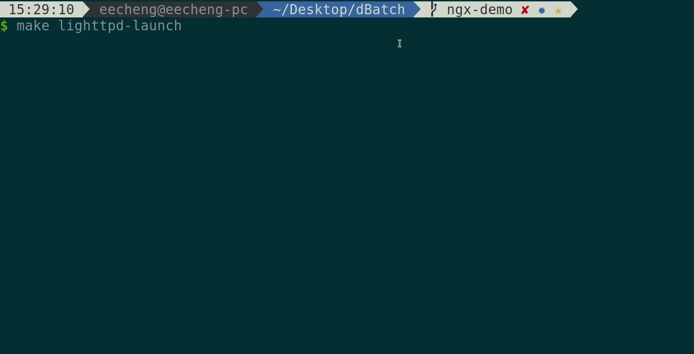

# Effective System Call Aggregation (ESCA)

The main objective of this work was to reduce the per-syscall overhead through the use of effective syscall aggregation.
For that purpose, ESCA takes advantages of system call batching and exploits the parallelism of event-driven applications by leveraging Linux I/O model to overcome the disadvantages of previous solutions.

ESCA is capable of reducing the per-syscall overhead by up to 62% for embedded web servers.
Real-world highly concurrent event-driven applications such as Nginx and Redis are known to benefit from ESCA, along with full compatibility with Linux syscall semantics and functionalities.

## Prerequisite
For Nginx and wrk:
```shell
sudo apt install build-essential libpcre3 libpcre3-dev zlib1g zlib1g-dev
sudo apt install libssl-dev libgd-dev libxml2 libxml2-dev uuid-dev
sudo apt install autoconf automake libtool
```

## Download project
```shell
git clone https://github.com/eecheng87/ESCA
cd ESCA
```

## Build from source
Compile files under directory `lkm/` and `wrapper/` (The default target is lwan)
```shell
make TARGET=<nginx | lighttpd | lwan>
```

### Build adaptation target
Build `wrk`
```shell
make wrk
```

Download and build nginx
```shell
make nginx
```

Download and build lighttpd
```shell
make lighttpd
```

Download and build lwan
```shell
make lwan
```

## Testing

### Launch Nginx
Choose either
```shell
make nginx-launch # origin nginx
```
or

```shell
make load-lkm
make nginx-esca-launch # nginx-esca
```

### Launch lighttpd
Choose either
```shell
make lighttpd-launch # origin lighttpd
```
or

```shell
make load-lkm
make lighttpd-esca-launch # lighttpd-esca
```

### Launch lwan
Choose either
```shell
make lwan-launch # origin lwan
```
or

```shell
make load-lkm
make lwan-esca-launch # lwan-esca
```

### Download workloads
```shell
git submodule init
git submodule update
```

### Benchmarking
```shell
# nginx is at port 8081; lighttpd is at port 3000; lwan is at port 8080
downloads/wrk-master/wrk -c 50 -d 5s -t 4 http://localhost:8081/a20.html
```

### Demo


Nginx-ESCA led by about 11% over vanilla Nginx.



lighttpd-ESCA led by about 13% over vanilla lighttpd.


lwan-ESCA led by about 30% over vanilla lwan.

## Citation

Please see our [PDP 2022](https://pdp2022.infor.uva.es/) paper, available in the [IEEE Xplore](https://ieeexplore.ieee.org/abstract/document/9756707) digital library, and you can get a [preprint copy](https://eecheng87.github.io/ESCA/main.pdf).

If you find this work useful in your research, please cite:
```
@inproceedings{cheng2022esca,
    author={Cheng, Yu-Cheng and Huang, Ching-Chun (Jim) and Tu, Chia-Heng},
    booktitle={2022 30th Euromicro International Conference on Parallel, Distributed and Network-based Processing (PDP)},
    title={ESCA: Effective System Call Aggregation for Event-Driven Servers},
    year={2022},
    pages={18-25},
    doi={10.1109/PDP55904.2022.00012}
}
```

## License

`ESCA` is released under the MIT license. Use of this source code is governed by
a MIT-style license that can be found in the LICENSE file.
