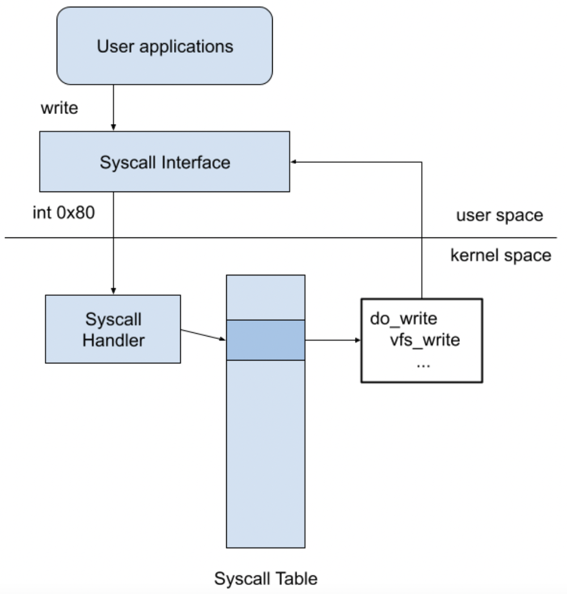

# Effective System Call Aggregation (ESCA)

The main objective of this work was to reduce the per-syscall overhead through the use of effective syscall aggregation.
For that purpose, ESCA takes advantages of system call batching and exploits the parallelism of event-driven applications by leveraging Linux I/O model to overcome the disadvantages of previous solutions.

ESCA is capable of reducing the per-syscall overhead by up to 62% for embedded web servers.
Real-world highly concurrent event-driven applications such as Nginx and Redis are known to benefit from ESCA, along with full compatibility with Linux syscall semantics and functionalities.

## Prerequisite
For Nginx and wrk:
```shell
sudo apt install build-essential libpcre3 libpcre3-dev zlib1g zlib1g-dev
sudo apt install libssl-dev libgd-dev libxml2 libxml2-dev uuid-dev
sudo apt install autoconf automake libtool
```

## Download project
```shell
git clone https://github.com/eecheng87/ESCA
cd ESCA
```

## Build from source
Compile files under directory `lkm/` and `wrapper/` (The default target is lwan)
```shell
make TARGET=<nginx | lighttpd | lwan>
```

### Build adaptation target
Build `wrk`
```shell
make wrk
```

Download and build nginx
```shell
make nginx
```

Download and build lighttpd
```shell
make lighttpd
```

Download and build lwan
```shell
make lwan
```

## Testing

### Launch Nginx
Choose either
```shell
make nginx-launch # origin nginx
```
or

```shell
make load-lkm
make nginx-esca-launch # nginx-esca
```

### Launch lighttpd
Choose either
```shell
make lighttpd-launch # origin lighttpd
```
or

```shell
make load-lkm
make lighttpd-esca-launch # lighttpd-esca
```

### Launch lwan
Choose either
```shell
make lwan-launch # origin lwan
```
or

```shell
make load-lkm
make lwan-esca-launch # lwan-esca
```

### Download workloads
```shell
git submodule init
git submodule update
```

### Benchmarking
```shell
# nginx is at port 8081; lighttpd is at port 3000; lwan is at port 8080
downloads/wrk-master/wrk -c 50 -d 5s -t 4 http://localhost:8081/a20.html
```

### Demo


Nginx-ESCA led by about 11% over vanilla Nginx.


lighttpd-ESCA led by about 13% over vanilla lighttpd.


lwan-ESCA led by about 30% over vanilla lwan.

## Technical Description
The code section enclosed by `batch_start()` and `batch_flush()` is called batching segment. It can appear more than one time in a single application.
Compared with typical syscalls, ESCA eliminates mode switches in batching segments by decoupling syscalls.
Instead of switching to the kernel or executing the corresponding service routine, syscalls in batching segment only record their syscall ID and arguments in the shared table.
After `batch_flush` is invoked, ESCA finally switches to kernel mode, executes all syscalls in the shared table, and then switches back to user mode.

### Typical system call flow


1. User application call system call
2. From user mode switches to kernel mode by an interrupt
3. Search interrupt vector table and call interrupt service routine(ISR)
4. The corresponding interrupt service routine would search system call table
5. Call system call service routine
6. After finishing system call service routine, switch back to user mode

### System Call wrappers
Because system call is invokved by assembly routines, wrapping the assembly code with the wrapper function would increase readability of the program.
e.g.,
```c
#define SYSCALL(name, a1, a2, a3, a4, a5, a6)                             \
    ({                                                                    \
        long result;                                                      \
        long __a1 = (long) (a1), __a2 = (long) (a2), __a3 = (long) (a3);  \
        long __a4 = (long) (a4), __a5 = (long) (a5), __a6 = (long) (a6);  \
        register long _a1 asm("rdi") = __a1;                              \
        register long _a2 asm("rsi") = __a2;                              \
        register long _a3 asm("rdx") = __a3;                              \
        register long _a4 asm("r10") = __a4;                              \
        register long _a5 asm("r8") = __a5;                               \
        register long _a6 asm("r9") = __a6;                               \
        asm volatile("syscall\n\t"                                        \
                     : "=a"(result)                                       \
                     : "0"(name), "r"(_a1), "r"(_a2), "r"(_a3), "r"(_a4), \
                       "r"(_a5), "r"(_a6)                                 \
                     : "memory", "cc", "r11", "cx");                      \
        (long) result;                                                    \
    })

#define SYSCALL1(name, a1) SYSCALL(name, a1, 0, 0, 0, 0, 0)
#define SYSCALL2(name, a1, a2) SYSCALL(name, a1, a2, 0, 0, 0, 0)
#define SYSCALL3(name, a1, a2, a3) SYSCALL(name, a1, a2, a3, 0, 0, 0)
#define SYSCALL4(name, a1, a2, a3, a4) SYSCALL(name, a1, a2, a3, a4, 0, 0)
#define SYSCALL5(name, a1, a2, a3, a4, a5) SYSCALL(name, a1, a2, a3, a4, a5, 0)
#define SYSCALL6(name, a1, a2, a3, a4, a5, a6) \
    SYSCALL(name, a1, a2, a3, a4, a5, a6)

/* wrapper function */
static inline void *brk(void *addr)
{
    return (void *) SYSCALL1(__NR_brk, addr);
}
```

### System Call Hooks
We cannot add syscalls without modifying the Linux kernel. What we can do is to replace an entry of the syscall table with our customized handler. It is crucial to make sure that the replaced entry is unused; otherwise, the system may crash after hooking the syscalls.

ESCA locate the address of the syscall table through the kernel symbol table and replace the syscall table entry with our customized handler. Also, it is necessary to clear the write protection bit of the control register if modifying the syscall table is required.

Two system call ESCA replaced
1. sys_batch: iterate shared table and execute all syscalls recorded in the shared table, then switch back to user mode.
2. sys_register: mapping userspace shared table to kernel space memory and initialization.

Replace system call handler
```c
// find out syscall table address
scTab = (void **) (smSCTab + ((char *) &system_wq - smSysWQ));
// clear write protection bit
allow_writes();

/* backup original system call service routine */
sys_oldcall0 = scTab[__NR_batch_flush];
sys_oldcall1 = scTab[__NR_register];

/* hooking */
scTab[__NR_batch_flush] = sys_batch;
scTab[__NR_register] = sys_register;

// set write protection bit
disallow_writes();
```

### Share the same physical address space between kernel and user space
ESCA use `get_user_pages` to get the physical page address which the userspace memory page corresponds to, and use `kmap` to map the physical pages to the kernel address space. In this way, data sharing is without the copy and the procedure is a one-time allocation.

* `batch_register` syscall maps userspace shared table to kernel space memory and initialization.
```c
asmlinkage long sys_register(const struct pt_regs *regs)
{
    int n_page, i, j;
    unsigned long p1 = regs->di;

    /* map batch table from user-space to kernel */
    n_page = get_user_pages(
        (p1),           /* Start address to map */
        MAX_THREAD_NUM, /* Number of pinned pages. 4096 btyes in this machine */
        FOLL_FORCE | FOLL_WRITE, /* Force flag */
        pinned_pages,            /* struct page ** pointer to pinned pages */
        NULL);

    for (i = 0; i < MAX_THREAD_NUM; i++)
        batch_table[i] = (struct batch_entry *) kmap(pinned_pages[i]);

    /* initial table status */
    for (j = 0; j < MAX_THREAD_NUM; j++)
        for (i = 0; i < MAX_ENTRY_NUM; i++)
            batch_table[j][i].rstatus = BENTRY_EMPTY;

    global_i = global_j = 0;

    main_pid = current->pid;

    return 0;
}
```

### Change the typical system call behavior
To change the behavior of the syscall, when the application is executed, the syscall wrapper of glibc is replaced with our shared library through LD_PRELOAD. Customized syscall wrapper will determine if the system call is in the `batch segment`.
1. Out of `batch segment`: call original glibc syscall wrapper we backup.
2. In `batch segment`: Record syscall ID and arguments in the shared table.

The function `dlsym()` takes a "handle" of a dynamic library returned by `dlopen()` and the null-terminated symbol name, returning the address where that symbol is loaded into memory.

Because the system call handler is dynamically linked to the customized system call handler during execution, we should backup original glibc system call handler by `dlsym()`.
```c
__attribute__((constructor)) static void setup(void)
{
    pgsize = getpagesize();
    in_segment = 0;
    batch_num = 0;

    /* store glibc function */
    real_writev = real_writev ? real_writev : dlsym(RTLD_NEXT, "writev");
    real_shutdown =
        real_shutdown ? real_shutdown : dlsym(RTLD_NEXT, "shutdown");
    real_sendfile =
        real_sendfile ? real_sendfile : dlsym(RTLD_NEXT, "sendfile");
    real_send =
        real_send ? real_send : dlsym(RTLD_NEXT, "send");

    global_i = global_j = 0;
}
```


## Citation

Please see our [PDP 2022](https://pdp2022.infor.uva.es/) paper, available in the [IEEE Xplore](https://ieeexplore.ieee.org/abstract/document/9756707) digital library, and you can get a [preprint copy](https://eecheng87.github.io/ESCA/main.pdf).

If you find this work useful in your research, please cite:
```
@inproceedings{cheng2022esca,
    author={Cheng, Yu-Cheng and Huang, Ching-Chun (Jim) and Tu, Chia-Heng},
    booktitle={2022 30th Euromicro International Conference on Parallel, Distributed and Network-based Processing (PDP)},
    title={ESCA: Effective System Call Aggregation for Event-Driven Servers},
    year={2022},
    pages={18-25},
    doi={10.1109/PDP55904.2022.00012}
}
```

## License

`ESCA` is released under the MIT license. Use of this source code is governed by
a MIT-style license that can be found in the LICENSE file.

## Reference
* B. M. Michelson, "Event-driven architecture overview," Patricia Seybold Group, vol. 2, no. 12, pp. 10–1571, 2006.
* A. S. Rahul Jadhav, Zhen Cao, "Improved system call batching for network I/O," 2019.
* A. Purohit, J. Spadavecchia, C. Wright, and E. Zadok, "Improving application performance through system call composition,"2003.
* M. Rajagopalan, S. K. Debray, M. A. Hiltunen, and R. D. Schlichting, "System call clustering: A profile-directed optimization technique," 2002.
* D. Hansen, [KAISER: unmap most of the kernel from userspace page tables](https://lwn.net/Articles/738997/), 2017
