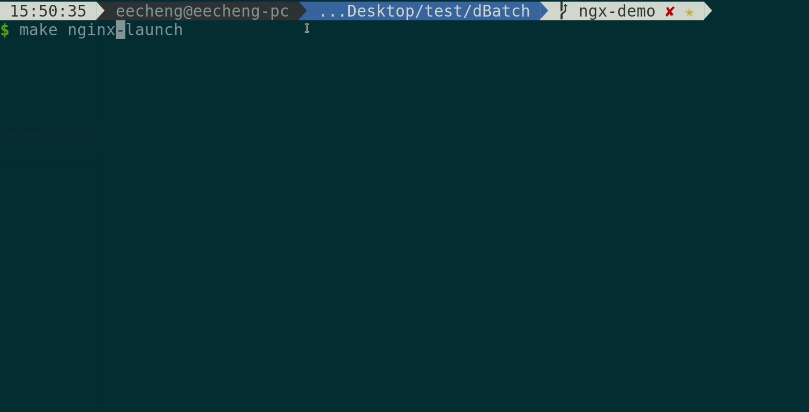

## Effective System Call Aggregation (ESCA)
The main objective of this work was to reduce the per-syscall overhead through the use of effective syscall aggregation. For that purpose, ESCA takes advantages of system call batching and exploits the parallelism of event-driven applications by leveraging Linux I/O model to overcome the disadvantages of previous solutions.

ESCA is capable of reducing the per-syscall overhead by up to 62% for embedded web servers. Real-world highly concurrent event-driven applications such as Nginx and Redis are known to benefit from ESCA, along with full compatibility with Linux syscall semantics and functionalities.

## Demo


Nginx-ESCA shows 11% improvements over vanilla Nginx.


lighttpd-ESCA shows 13% improvements over vanilla lighttpd.

## Relative Talk
We also present our work with topic: *Reduce System Call Overhead for Event-Driven Servers* at Open Source Submit Japan 2021

* [Speak Information](https://ossalsjp21.sched.com/event/peeF/reduce-system-call-overhead-for-event-driven-servers-jim-huang-biilabs-co-ltd-steven-cheng-national-cheng-kung-university)
* [Record](https://youtu.be/_E69oqLsm-0)
* [Slide](https://static.sched.com/hosted_files/ossalsjp21/c6/Reduce%20System%20Call%20Overhead%20For%20Event%20Driven%20Servers.pdf)

## Academic Paper
ESCA: Effective System Call Aggregation for Event-Driven Servers

*Yu-Cheng Cheng, Ching-Chun (Jim) Huang, Chia-Heng Tu*

PDP 2022: paper is published by [IEEE](https://ieeexplore.ieee.org/abstract/document/9756707?casa_token=FNEPLSTw9zoAAAAA:j19CRSIwB5a74niRUUlwKVTJlpe55wCPNkYlzbn55T5r3ISrm3SnqGkujaCsX8qHPT8Gi27iFA) and is available at <a href="main.pdf" target="_blank">here</a>

```
@INPROCEEDINGS{9756707,
    author={Cheng, Yu-Cheng and Huang, Ching-Chun (Jim) and Tu, Chia-Heng},
    booktitle={2022 30th Euromicro International Conference on Parallel, Distributed and Network-based Processing (PDP)},
    title={ESCA: Effective System Call Aggregation for Event-Driven Servers},
    year={2022},
    pages={18-25},
    doi={10.1109/PDP55904.2022.00012}
}
```
